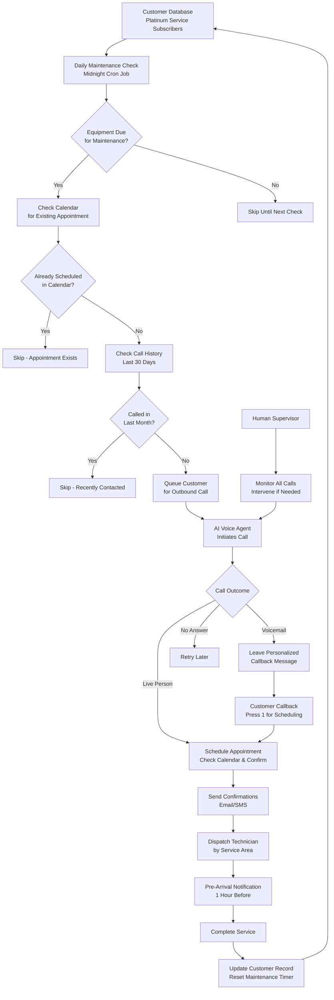
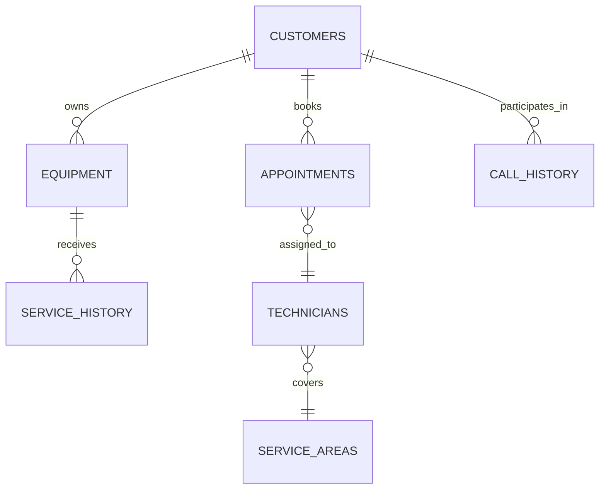

# Acme HVAC AI Voice Agent - Business Process

## Executive Summary

**Client:** Acme HVAC  
**Consultants:** Dan and Dave (App-Vitals)  
**Solution:** AI-powered voice agent for automated maintenance scheduling  
**Business Model:** Platinum Service - Monthly subscription for free annual maintenance of hot water heaters, furnaces, and central air units  

**Value Proposition:** Eliminate manual scheduling calls by automating customer outreach, appointment booking, and technician dispatch while maintaining service quality.

## Business Process Overview

Acme HVAC's Platinum Service customers pay a monthly fee for comprehensive annual maintenance. The AI voice agent identifies customers due for service, initiates contact, schedules appointments, and coordinates technician dispatch—replacing the manual work previously done by office staff.

## Core Business Process Flow

## Key Call Scenarios

### Scenario 1: Outbound to Live Person
1. **AI Agent calls customer using database phone number**
2. **Greeting**: "Hi [Name], this is Sarah from Acme HVAC calling about your Platinum Service"
3. **Context**: "Your [equipment type] is due for its annual maintenance"
4. **Scheduling**: Check customer availability and propose technician time slots
5. **Confirmation**: Book appointment and send email/SMS confirmation
6. **Outcome**: Scheduled appointment with technician assigned

### Scenario 2: Outbound to Voicemail
1. **AI detects voicemail and leaves personalized message**
2. **Message**: Customer name, equipment due, callback number
3. **Customer calls back and presses 1 for scheduling**
4. **AI handles callback with full scheduling conversation**
5. **Outcome**: Either scheduled appointment or human escalation

### Scenario 3: Inbound Customer Support
1. **Customer calls with questions or concerns**
2. **AI provides basic support or transfers to human**
3. **If scheduling-related, handles like live person scenario**
4. **Outcome**: Resolved issue or successful transfer

## Data Structure Overview

The system tracks customer information, equipment inventory, service history, and appointment scheduling through interconnected data tables:

**Key Data Points:**
- **Customer**: Name, phone, address, platinum service status, preferred contact times
- **Equipment**: Type (HVAC/furnace/hot water heater), installation date, last service date
- **Service History**: Maintenance records, next due date, technician notes
- **Appointments**: Date/time, technician assigned, service area, confirmation status
- **Call History**: AI conversations, outcomes, human interventions required

## Business Metrics & Success Criteria

### Operational Efficiency
- **Call-to-Schedule Conversion**: Target >80% of outbound calls result in scheduled appointments
- **First-Call Resolution**: Target >90% of calls completed without human intervention
- **Average Call Duration**: Target <3 minutes for scheduling calls
- **Voicemail Callback Rate**: Target >60% of voicemail recipients call back within 48 hours

### Customer Experience
- **Customer Satisfaction**: Maintain >4.5/5 rating for AI scheduling experience
- **Appointment No-Show Rate**: Keep <10% of scheduled appointments
- **Schedule Compliance**: Maintain 95% of appointments within promised time windows

### Business Impact
- **Labor Cost Reduction**: Eliminate 20+ hours/week of manual scheduling
- **Revenue Protection**: Maintain 98%+ platinum service subscription retention
- **Technician Utilization**: Optimize routing to achieve 85%+ billable time

## Current Implementation Status

### ✅ Currently Implemented
- AI voice agent with inbound/outbound call handling
- Voicemail detection and personalized message leaving
- Customer database lookup by phone number
- Web monitoring interface for human supervisors
- LiveKit/Twilio integration for reliable call processing

### 🔄 In Development
- Complete customer database with service history
- Calendar integration for real-time technician scheduling
- Automated confirmation system (email/SMS)
- Geographic service area optimization

### 📋 Planned Enhancements
- Predictive scheduling based on equipment age and usage
- Integration with existing Acme HVAC CRM system
- Advanced analytics dashboard for performance monitoring
- Multi-channel communication preferences (voice/email/SMS)

## Quality Control Process

**Human Oversight Integration:**
- Supervisors monitor all calls through web interface with live transcription
- Calls exceeding 1 minute trigger automatic alerts for potential issues
- Human agents can join any call in progress via LiveKit rooms
- All conversations stored with transcripts for quality review and training

**Call Recording & Compliance:**
- Optional call recording with customer consent ("Press X to opt out")
- Transcript-only mode for customers who decline recording
- Full compliance with telecommunication regulations and privacy laws

## Success Timeline

**Month 1-2**: Full system deployment with manual scheduling backup  
**Month 3-4**: Achieve target conversion rates and customer satisfaction scores  
**Month 5-6**: Optimize technician routing and appointment efficiency  
**Month 6+**: Realize full ROI through labor cost savings and improved utilization

---

*This business process enables Acme HVAC to scale their Platinum Service offerings while reducing administrative overhead and maintaining the high-quality customer experience that differentiates their service.*