# Acme HVAC AI Voice Agent - Business Process Documentation

## Executive Summary

**Client:** Acme HVAC  
**Consultants:** Dan and Dave (App-Vitals)  
**Solution:** AI-powered voice agent for automated maintenance scheduling  
**Business Model:** Platinum Service - Monthly fee for free annual maintenance of hot water heaters, furnaces, and central air units  

**Value Proposition:** Replace manual, mundane employee scheduling tasks with AI-driven automation while maintaining high service quality and customer satisfaction.

## Customer Journey Overview

Acme HVAC's Platinum Service customers pay a monthly fee for comprehensive annual maintenance coverage. The AI voice agent automates the entire scheduling process, from identifying customers due for service to confirming appointments and dispatching technicians.

## Core Business Process Flow

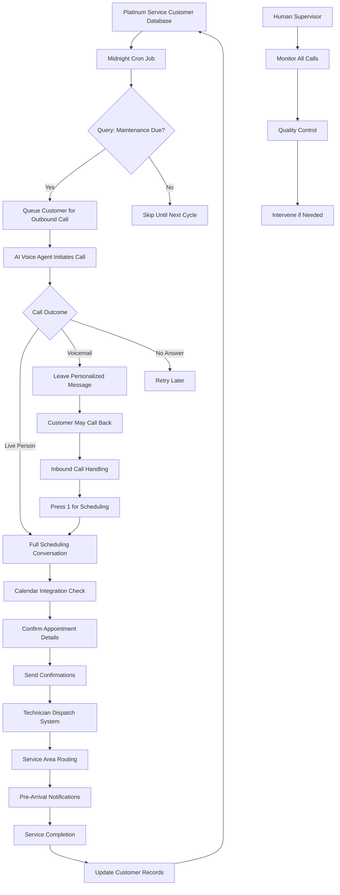

## Detailed Process Stages

### 1. Customer Database Management

**Database Schema:**

```sql
-- Customer Information Table
CREATE TABLE customers (
    id UUID PRIMARY KEY DEFAULT gen_random_uuid(),
    first_name VARCHAR(100) NOT NULL,
    last_name VARCHAR(100) NOT NULL,
    phone_primary VARCHAR(20) UNIQUE NOT NULL, -- Used for caller ID lookup
    phone_secondary VARCHAR(20),
    email_primary VARCHAR(255),
    email_secondary VARCHAR(255),
    address_line1 VARCHAR(255) NOT NULL,
    address_line2 VARCHAR(255),
    city VARCHAR(100) NOT NULL,
    state VARCHAR(2) NOT NULL,
    zip_code VARCHAR(10) NOT NULL,
    service_area_id UUID REFERENCES service_areas(id),
    platinum_service_start_date DATE NOT NULL,
    platinum_service_status VARCHAR(20) DEFAULT 'active', -- active, suspended, cancelled
    preferred_call_time_start TIME,
    preferred_call_time_end TIME,
    preferred_contact_method VARCHAR(20) DEFAULT 'phone', -- phone, email, sms
    do_not_call BOOLEAN DEFAULT FALSE,
    notes TEXT,
    created_at TIMESTAMP WITH TIME ZONE DEFAULT NOW(),
    updated_at TIMESTAMP WITH TIME ZONE DEFAULT NOW()
);

-- Equipment Inventory Table
CREATE TABLE customer_equipment (
    id UUID PRIMARY KEY DEFAULT gen_random_uuid(),
    customer_id UUID NOT NULL REFERENCES customers(id) ON DELETE CASCADE,
    equipment_type VARCHAR(50) NOT NULL, -- 'hvac', 'hot_water_heater', 'furnace'
    equipment_brand VARCHAR(100),
    equipment_model VARCHAR(100),
    installation_date DATE,
    warranty_expiration DATE,
    maintenance_frequency_months INTEGER DEFAULT 12,
    equipment_location VARCHAR(100), -- 'basement', 'attic', 'garage', etc.
    special_instructions TEXT,
    is_active BOOLEAN DEFAULT TRUE,
    created_at TIMESTAMP WITH TIME ZONE DEFAULT NOW(),
    updated_at TIMESTAMP WITH TIME ZONE DEFAULT NOW()
);

-- Service History Table
CREATE TABLE service_history (
    id UUID PRIMARY KEY DEFAULT gen_random_uuid(),
    customer_id UUID NOT NULL REFERENCES customers(id) ON DELETE CASCADE,
    equipment_id UUID REFERENCES customer_equipment(id),
    technician_id UUID REFERENCES technicians(id),
    service_type VARCHAR(50) NOT NULL, -- 'maintenance', 'repair', 'installation'
    service_date DATE NOT NULL,
    service_time_start TIME,
    service_time_end TIME,
    work_performed TEXT NOT NULL,
    parts_used TEXT,
    total_cost DECIMAL(10,2),
    customer_satisfaction_rating INTEGER CHECK (customer_satisfaction_rating >= 1 AND customer_satisfaction_rating <= 5),
    notes TEXT,
    next_maintenance_due DATE,
    created_at TIMESTAMP WITH TIME ZONE DEFAULT NOW(),
    updated_at TIMESTAMP WITH TIME ZONE DEFAULT NOW()
);

-- Call History Table
CREATE TABLE call_history (
    id UUID PRIMARY KEY DEFAULT gen_random_uuid(),
    customer_id UUID NOT NULL REFERENCES customers(id) ON DELETE CASCADE,
    call_direction VARCHAR(10) NOT NULL, -- 'inbound', 'outbound'
    call_type VARCHAR(50) NOT NULL, -- 'scheduling', 'reminder', 'callback', 'support'
    phone_number_called VARCHAR(20),
    call_start_time TIMESTAMP WITH TIME ZONE NOT NULL,
    call_end_time TIMESTAMP WITH TIME ZONE,
    call_duration_seconds INTEGER,
    call_outcome VARCHAR(50) NOT NULL, -- 'scheduled', 'voicemail', 'no_answer', 'busy', 'completed'
    appointment_scheduled BOOLEAN DEFAULT FALSE,
    appointment_id UUID REFERENCES appointments(id),
    transcript TEXT,
    recording_url VARCHAR(500),
    ai_confidence_score DECIMAL(3,2), -- 0.00 to 1.00
    human_intervention_required BOOLEAN DEFAULT FALSE,
    notes TEXT,
    created_at TIMESTAMP WITH TIME ZONE DEFAULT NOW()
);

-- Appointments Table
CREATE TABLE appointments (
    id UUID PRIMARY KEY DEFAULT gen_random_uuid(),
    customer_id UUID NOT NULL REFERENCES customers(id) ON DELETE CASCADE,
    equipment_ids UUID[] NOT NULL, -- Array of equipment IDs to service
    technician_id UUID REFERENCES technicians(id),
    appointment_date DATE NOT NULL,
    appointment_time_start TIME NOT NULL,
    appointment_time_end TIME NOT NULL,
    appointment_type VARCHAR(50) NOT NULL, -- 'maintenance', 'repair', 'inspection'
    status VARCHAR(20) DEFAULT 'scheduled', -- scheduled, confirmed, in_progress, completed, cancelled, no_show
    confirmation_sent_at TIMESTAMP WITH TIME ZONE,
    reminder_sent_at TIMESTAMP WITH TIME ZONE,
    pre_arrival_notification_sent BOOLEAN DEFAULT FALSE,
    customer_notes TEXT,
    technician_notes TEXT,
    estimated_duration_minutes INTEGER,
    created_at TIMESTAMP WITH TIME ZONE DEFAULT NOW(),
    updated_at TIMESTAMP WITH TIME ZONE DEFAULT NOW()
);

-- Service Areas Table (for technician routing)
CREATE TABLE service_areas (
    id UUID PRIMARY KEY DEFAULT gen_random_uuid(),
    area_name VARCHAR(100) NOT NULL,
    zip_codes TEXT[] NOT NULL, -- Array of zip codes covered
    primary_technician_id UUID REFERENCES technicians(id),
    backup_technician_ids UUID[], -- Array of backup technician IDs
    travel_time_minutes INTEGER DEFAULT 30,
    is_active BOOLEAN DEFAULT TRUE,
    created_at TIMESTAMP WITH TIME ZONE DEFAULT NOW()
);

-- Technicians Table
CREATE TABLE technicians (
    id UUID PRIMARY KEY DEFAULT gen_random_uuid(),
    first_name VARCHAR(100) NOT NULL,
    last_name VARCHAR(100) NOT NULL,
    phone VARCHAR(20) NOT NULL,
    email VARCHAR(255) UNIQUE NOT NULL,
    employee_id VARCHAR(50) UNIQUE,
    specializations TEXT[], -- Array of specializations like 'hvac', 'plumbing', etc.
    service_area_ids UUID[] NOT NULL, -- Array of service area IDs
    is_active BOOLEAN DEFAULT TRUE,
    hire_date DATE,
    created_at TIMESTAMP WITH TIME ZONE DEFAULT NOW(),
    updated_at TIMESTAMP WITH TIME ZONE DEFAULT NOW()
);

-- Maintenance Schedule Queue (for cron job processing)
CREATE TABLE maintenance_queue (
    id UUID PRIMARY KEY DEFAULT gen_random_uuid(),
    customer_id UUID NOT NULL REFERENCES customers(id) ON DELETE CASCADE,
    equipment_id UUID NOT NULL REFERENCES customer_equipment(id) ON DELETE CASCADE,
    due_date DATE NOT NULL,
    priority INTEGER DEFAULT 1, -- 1=normal, 2=high, 3=urgent
    attempts INTEGER DEFAULT 0,
    last_attempt_at TIMESTAMP WITH TIME ZONE,
    status VARCHAR(20) DEFAULT 'pending', -- pending, in_progress, scheduled, completed, failed
    notes TEXT,
    created_at TIMESTAMP WITH TIME ZONE DEFAULT NOW(),
    updated_at TIMESTAMP WITH TIME ZONE DEFAULT NOW()
);

-- Indexes for performance
CREATE INDEX idx_customers_phone_primary ON customers(phone_primary);
CREATE INDEX idx_customers_zip_code ON customers(zip_code);
CREATE INDEX idx_customers_platinum_status ON customers(platinum_service_status);
CREATE INDEX idx_service_history_customer_date ON service_history(customer_id, service_date DESC);
CREATE INDEX idx_call_history_customer_date ON call_history(customer_id, call_start_time DESC);
CREATE INDEX idx_appointments_date_technician ON appointments(appointment_date, technician_id);
CREATE INDEX idx_maintenance_queue_due_date ON maintenance_queue(due_date, status);
```

**Key Relationships:**
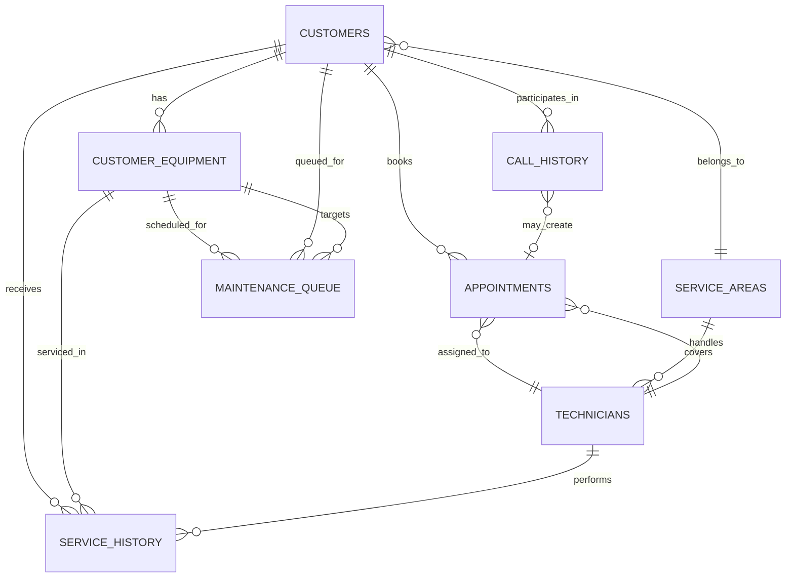

**Maintenance Scheduling Logic:**
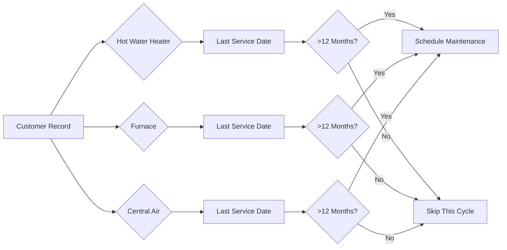

### 2. Automated Scheduling System

**Cron Job Workflow (Daily at Midnight):**

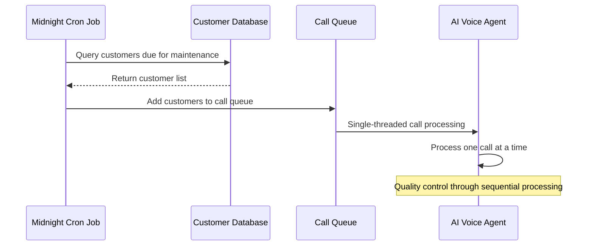

### 3. Three Call Flow Scenarios

#### Scenario A: Outbound to Voicemail
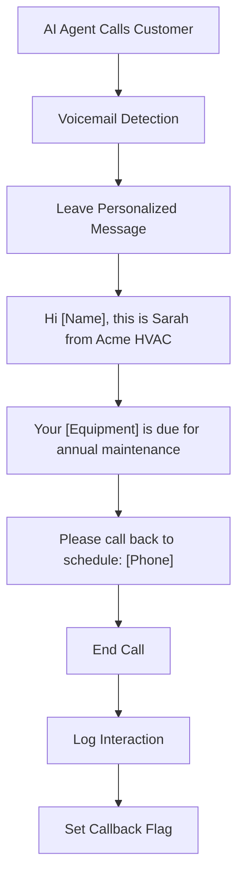

#### Scenario B: Outbound to Live Person
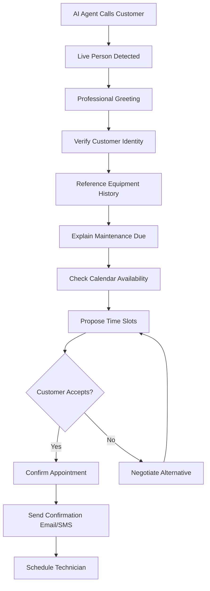

#### Scenario C: Inbound Callback
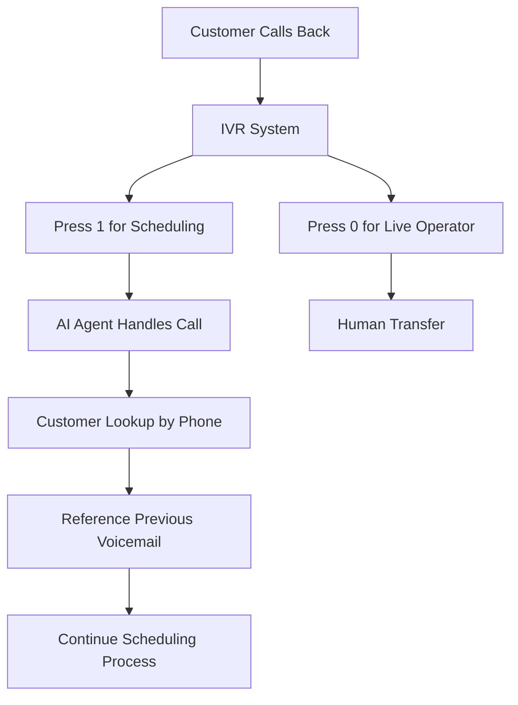

### 4. Appointment Scheduling & Confirmation

**Calendar Integration Workflow:**
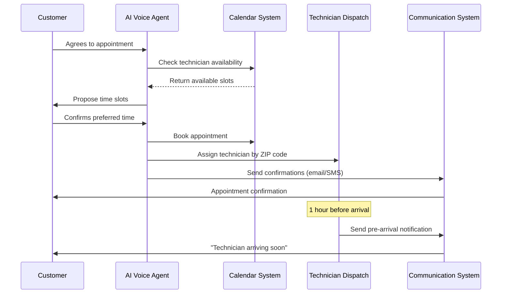

### 5. Quality Control & Human Oversight

**Monitoring Dashboard Features:**
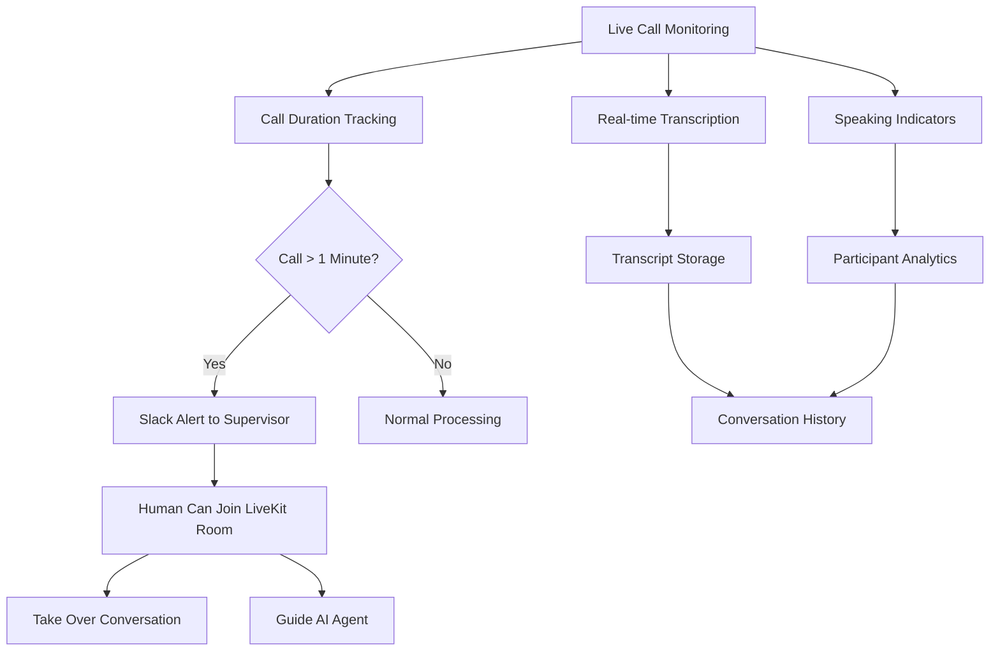

**Call Recording & Compliance:**
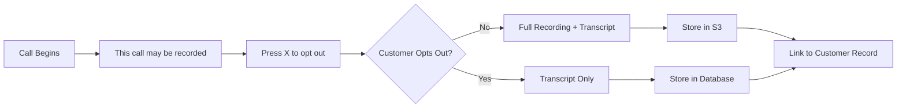

## Technical Infrastructure Map

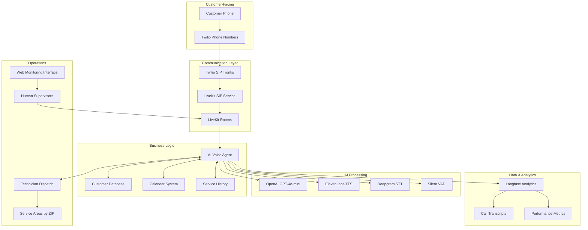

## Service Area & Technician Routing

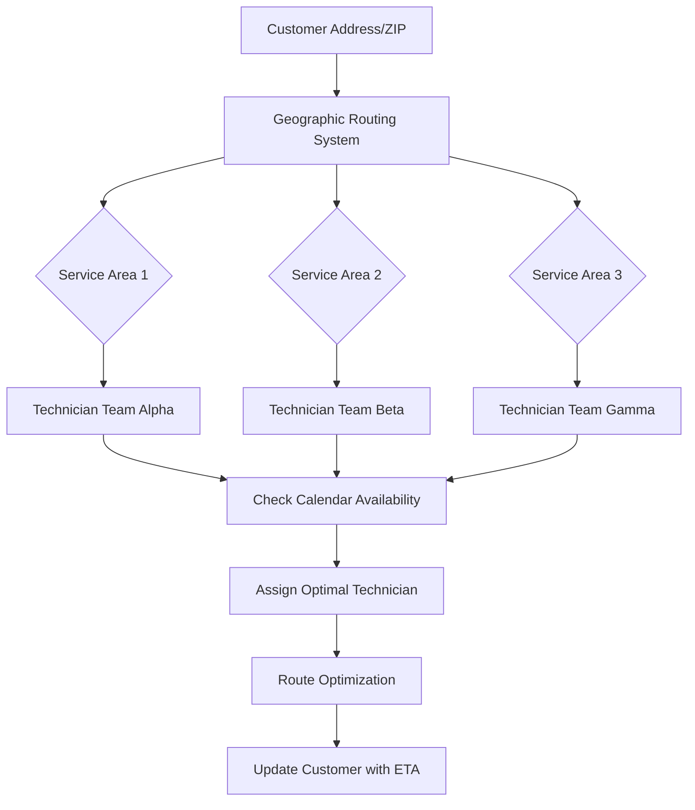

## Business Metrics & KPIs

### Operational Efficiency
- **Call-to-Schedule Conversion Rate**: % of outbound calls that result in confirmed appointments
- **Voicemail Callback Rate**: % of voicemail recipients who call back to schedule
- **Average Call Duration**: Target <3 minutes for scheduling calls
- **First-Call Resolution**: % of calls completed without human intervention

### Customer Experience
- **Customer Satisfaction Score**: Post-service survey ratings
- **Appointment No-Show Rate**: % of scheduled appointments missed
- **Callback Response Time**: Time from voicemail to customer return call
- **Schedule Compliance**: % of appointments kept within time windows

### Business Impact
- **Labor Cost Reduction**: Hours saved from automated vs. manual scheduling
- **Revenue per Customer**: Platinum service subscription retention
- **Technician Utilization**: % of technician capacity optimally scheduled
- **Service Area Coverage**: Geographic efficiency metrics

## Process Optimization Opportunities

### Phase 1 (Current Implementation)
- ✅ Basic voice agent with dual-mode behavior
- ✅ Voicemail detection and handling
- ✅ Customer data lookup and personalization
- ✅ Web monitoring interface

### Phase 2 (Near-term Enhancements)
- 🔄 **Full Customer Database Integration**: Complete service history tracking
- 🔄 **Advanced Calendar System**: Real-time technician availability
- 🔄 **Multi-channel Confirmations**: Email, SMS, and voice confirmations
- 🔄 **Predictive Scheduling**: AI-driven optimal appointment timing

### Phase 3 (Advanced Features)
- 🔮 **Predictive Maintenance**: Equipment failure prediction
- 🔮 **Dynamic Pricing**: Seasonal and demand-based pricing
- 🔮 **Customer Preference Learning**: AI-driven personalization
- 🔮 **Weather Integration**: Schedule adjustments for weather conditions

### Phase 4 (Scale & Intelligence)
- 🔮 **Multi-location Support**: Franchise operation capabilities
- 🔮 **Advanced Analytics**: Business intelligence dashboard
- 🔮 **Customer Lifetime Value**: Predictive customer analytics
- 🔮 **Competitive Intelligence**: Market-based scheduling optimization

## Risk Mitigation & Contingency Plans

### Technical Risks
- **AI Agent Failure**: Human fallback system with immediate escalation
- **Phone System Outage**: Multiple carrier redundancy
- **Database Corruption**: Real-time backup and recovery procedures

### Business Risks
- **Customer Dissatisfaction**: Quality monitoring with immediate human intervention
- **Regulatory Compliance**: Call recording opt-out and data privacy protection
- **Technician Capacity**: Overflow scheduling with partner contractors

## Success Measurement Framework

**ROI Calculation:**
- Monthly cost savings from automation
- Customer retention improvement
- Technician efficiency gains
- Reduced no-show rates
- Overall platinum service profitability increase

**Timeline for Full ROI:** 6-12 months based on customer base size and call volume.

---

*This business process documentation serves as the foundation for Acme HVAC's AI voice agent implementation, ensuring seamless automation while maintaining the high-quality customer service that defines their platinum service offering.*