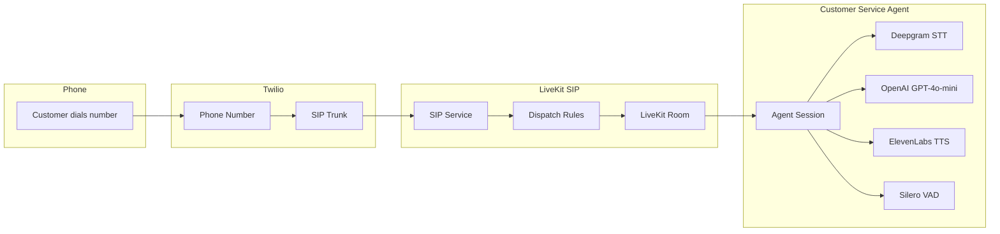
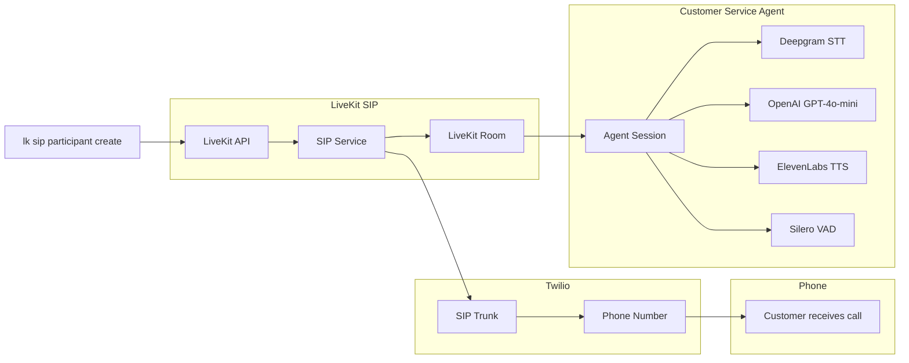

# LiveKit Twilio Customer Service Agent

AI-powered voice agent that handles phone calls through LiveKit SIP integration with Twilio, representing Dan and Dave's AI Consulting in Tahoe, CA.

## Features

- **Dual Call Modes**: Automatically adapts behavior for inbound vs outbound calls
- **Voice AI Agent**: Powered by OpenAI GPT-4o-mini with ElevenLabs TTS and Deepgram STT
- **Voicemail Detection**: Automatically detects voicemail systems and leaves professional messages (outbound only)
- **Robust Connection**: Timeout handling and retry logic for reliable connections
- **Phone Integration**: Handles calls via Twilio SIP trunks and LiveKit
- **Observability**: Full conversation tracking and analytics with Langfuse integration

## Prerequisites

- Python 3.11+
- [LiveKit account](https://livekit.io/) with SIP service enabled
- [Twilio account](https://www.twilio.com/) with phone number and SIP trunking
- [LiveKit CLI](https://docs.livekit.io/home/cli/) installed (`lk` command)
- API keys for OpenAI, ElevenLabs, and Deepgram
- [Langfuse account](https://langfuse.com/) for conversation observability (optional)

## Setup

1. **Install dependencies**:
   ```bash
   uv sync
   ```

2. **Configure environment variables**:
   ```bash
   cd backend
   cp .env.example .env
   ```
   Edit `.env` with your API keys and credentials, including:
   - LiveKit and Twilio credentials
   - OpenAI, ElevenLabs, and Deepgram API keys
   - Langfuse credentials (optional, for observability)

3. **Set up telephony configuration**:
   ```bash
   cp livekit-telephony-templates/*.template .
   # Remove .template extension from each file
   for file in *.template; do mv "$file" "${file%.template}"; done
   ```
   Edit each JSON file with your specific credentials.

4. **Initialize LiveKit SIP trunks**:
   ```bash
   cd backend
   uv run scripts/setup_livekit_telephony.py
   ```

5. **Set your SIP trunk ID**:
   After running the setup script, add your SIP trunk ID to `backend/.env`:
   ```bash
   LIVEKIT_SIP_TRUNK_ID=ST_your_trunk_id_here
   ```

## Usage

Start the customer service agent:
```bash
cd backend
uv run python agent.py dev
```

The agent will:
- Connect to LiveKit rooms with robust timeout/retry logic
- Automatically detect call direction from room names (`inbound*` vs `outbound*`)
- **Inbound calls**: Answer professionally and provide customer service
- **Outbound calls**: Proactively contact customers with voicemail detection
- Act as Sarah, representing Dan and Dave's AI Consulting in Tahoe, CA

## Testing

You can test the agent by making outbound calls:

```bash
cd backend
uv run python scripts/make_outbound_call.py "+15551234567"
```

## Architecture

### Inbound Call Flow


### Outbound Call Flow


## Call Behavior

The agent automatically adapts its behavior based on room naming:

### Inbound Calls (room name starts with `inbound`)
- **Role**: Customer service representative
- **Greeting**: Professional introduction and "how can I help you?"
- **Tools**: None (standard conversation only)
- **Purpose**: Handle customer inquiries and support requests

### Outbound Calls (room name starts with `outbound`)
- **Role**: Proactive caller for service appointments/reminders
- **Greeting**: Introduce self and reason for calling
- **Tools**: Voicemail detection and automated message leaving
- **Purpose**: Contact customers about specific services or appointments

**Main Components:**
- `backend/agent.py` - Voice AI agent with dual-mode behavior and robust connection handling
- `backend/scripts/setup_livekit_telephony.py` - Automated Twilio/LiveKit setup
- `livekit-telephony-templates/` - Configuration templates for SIP trunks, dispatch rules, and test participants
