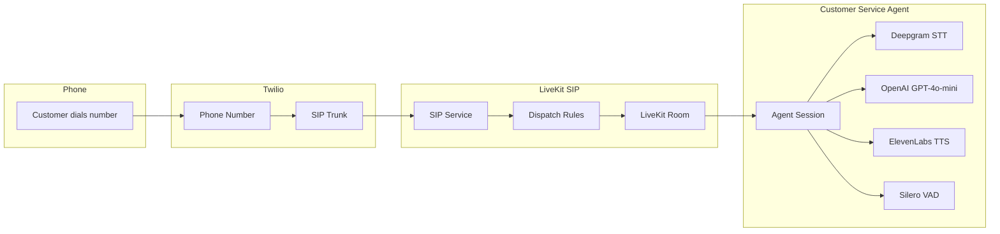
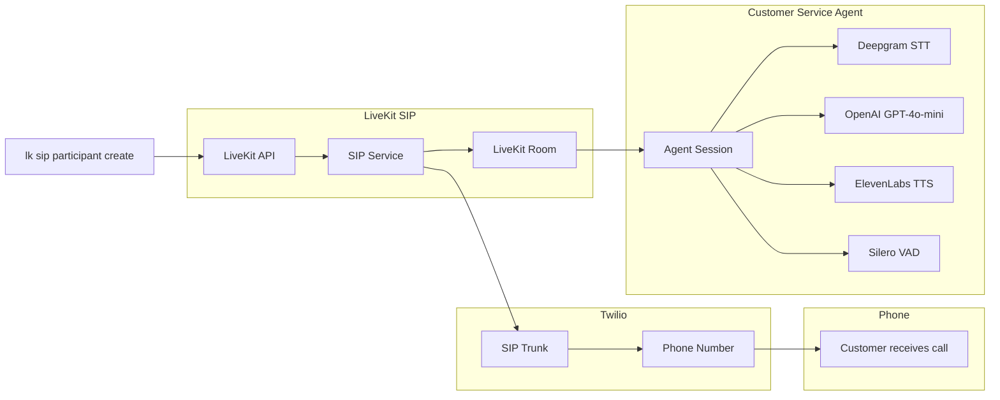

# LiveKit Twilio Customer Service Agent

AI-powered voice assistant that handles phone calls through LiveKit SIP integration with Twilio, representing Dan and Dave's AI Consulting in Tahoe, CA.

## Features

- **Voice AI Assistant**: Powered by OpenAI GPT-4o-mini with ElevenLabs TTS and Deepgram STT
- **Phone Integration**: Handles inbound/outbound calls via Twilio SIP trunks
- **Voicemail Detection**: Automatically detects voicemail systems and leaves professional messages
- **Noise Cancellation**: Enhanced audio processing for telephony applications
- **Multi-language Support**: Voice activity detection with multilingual turn detection

## Prerequisites

- Python 3.11+
- [LiveKit account](https://livekit.io/) with SIP service enabled
- [Twilio account](https://www.twilio.com/) with phone number and SIP trunking
- [LiveKit CLI](https://docs.livekit.io/home/cli/) installed (`lk` command)
- API keys for OpenAI, ElevenLabs, and Deepgram

## Setup

1. **Install dependencies**:
   ```bash
   uv sync
   ```

2. **Configure environment variables**:
   ```bash
   cp .env.example .env
   ```
   Edit `.env` with your API keys and credentials.

3. **Set up telephony configuration**:
   ```bash
   cp livekit-telephony-templates/*.template .
   # Remove .template extension from each file
   for file in *.template; do mv "$file" "${file%.template}"; done
   ```
   Edit each JSON file with your specific credentials.

4. **Initialize LiveKit SIP trunks**:
   ```bash
   uv run scripts/setup_livekit_telephony.py
   ```

5. **Set your SIP trunk ID**:
   After running the setup script, add your SIP trunk ID to `.env`:
   ```bash
   LIVEKIT_SIP_TRUNK_ID=ST_your_trunk_id_here
   ```

## Usage

Start the voice AI agent:
```bash
uv run python agent.py dev
```

The agent will:
- Connect to your LiveKit room
- Handle incoming/outgoing phone calls via configured SIP trunks
- Automatically detect voicemail systems and leave appropriate messages
- Respond as Sarah, representing Dan and Dave's AI Consulting in Tahoe, CA

## Testing

You can test the agent by making outbound calls:

1. **Make an outbound call**:
   ```bash
   uv run python scripts/make_outbound_call.py "+15551234567" --customer-name "John Doe" --service-due "HVAC maintenance"
   ```

2. **List active calls**:
   ```bash
   uv run python scripts/make_outbound_call.py "+15551234567" --list-calls
   ```

3. **Hang up a call**:
   ```bash
   uv run python scripts/make_outbound_call.py "+15551234567" --hangup <participant-id>
   ```

## Architecture

### Inbound Call Flow


### Outbound Call Flow


**Main Components:**
- `agent.py` - Voice AI agent with OpenAI GPT-4o-mini, ElevenLabs TTS, Deepgram STT
- `scripts/setup_livekit_telephony.py` - Automated Twilio/LiveKit setup
- `livekit-telephony-templates/` - Configuration templates for SIP trunks, dispatch rules, and test participants
