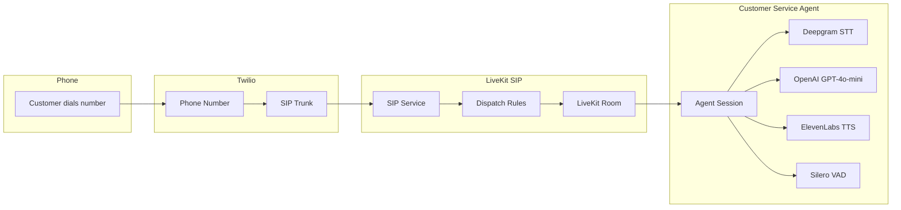
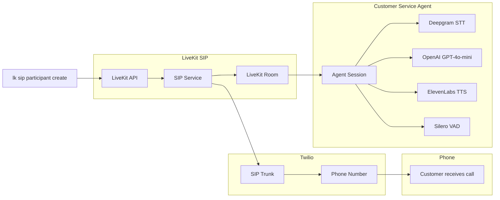

# LiveKit Twilio Customer Service Agent

AI-powered voice agent that handles phone calls through LiveKit SIP integration with Twilio, representing Acme HVAC for customer service and maintenance scheduling.

## Features

- **Dual Call Modes**: Automatically adapts behavior for inbound vs outbound calls
- **Voice AI Agent**: Powered by OpenAI GPT-4.1 with ElevenLabs TTS and Deepgram STT
- **Customer Data Integration**: Dynamic customer lookup and context-aware conversations
- **Template-Based Prompts**: XML-structured prompts with shared context
- **Appointment Scheduling**: Focus on scheduling HVAC maintenance appointments
- **Voicemail Detection**: Automatically detects voicemail systems and leaves professional messages
- **Web Call Monitoring**: Real-time web interface for supervisors to join and monitor active calls
- **Robust Connection**: Timeout handling and retry logic for reliable connections
- **Phone Integration**: Handles calls via Twilio SIP trunks and LiveKit
- **Observability**: Full conversation tracking and analytics with Langfuse integration

## Prerequisites

- Python 3.11+
- Node.js 18+ (for web interface)
- [LiveKit account](https://livekit.io/) with SIP service enabled
- [Twilio account](https://www.twilio.com/) with phone number and SIP trunking
- [LiveKit CLI](https://docs.livekit.io/home/cli/) installed (`lk` command)
- API keys for OpenAI, ElevenLabs, and Deepgram
- [Langfuse account](https://langfuse.com/) for conversation observability (optional)

## Setup

1. **Install backend dependencies**:
   ```bash
   uv sync
   ```

2. **Install frontend dependencies**:
   ```bash
   cd frontend
   npm install
   cd ..
   ```

3. **Configure environment variables**:
   ```bash
   cd backend
   cp .env.example .env
   ```
   Edit `.env` with your API keys and credentials, including:
   - LiveKit and Twilio credentials
   - OpenAI, ElevenLabs, and Deepgram API keys
   - Langfuse credentials (optional, for observability)

4. **Set up telephony configuration**:
   ```bash
   cp livekit-telephony-templates/*.template .
   # Remove .template extension from each file
   for file in *.template; do mv "$file" "${file%.template}"; done
   ```
   Edit each JSON file with your specific credentials.

5. **Initialize LiveKit SIP trunks**:
   ```bash
   cd backend
   uv run scripts/setup_livekit_telephony.py
   ```

6. **Set your SIP trunk ID**:
   After running the setup script, add your SIP trunk ID to `backend/.env`:
   ```bash
   LIVEKIT_SIP_TRUNK_ID=ST_your_trunk_id_here
   ```

## Usage

### Start the Customer Service Agent

```bash
cd backend
uv run python agent.py dev
```

The agent will connect to LiveKit rooms with robust timeout/retry logic and act as Sarah from Acme HVAC. See the [Call Behavior](#call-behavior) section for detailed information about how the agent handles different call types.

### Start the Web Monitoring Interface

1. **Start the API server**:
   ```bash
   cd backend
   python api.py
   ```

2. **Start the frontend** (in a new terminal):
   ```bash
   cd frontend
   npm run dev
   ```

3. **Access the interface**:
   - Open http://localhost:3000 in your browser
   - Enter your name (e.g., "Supervisor")
   - Select an active customer service call to join
   - Monitor the conversation with live transcription and participant indicators

## Testing

### Make Test Calls

```bash
cd backend
uv run python scripts/make_outbound_call.py "+15551234567"
```

### Monitor Calls via Web Interface

1. Start the agent and API as described above
2. Make an outbound call using the script
3. Open the web interface and join the active call
4. You'll be able to hear the conversation and see live transcription

## Architecture

### Inbound Call Flow


### Outbound Call Flow


## Call Behavior

The agent automatically adapts its behavior based on room naming format `{inbound|outbound}_{phone_number}_{random_str}`:

### Inbound Calls (`inbound_{phone}_...`)
- **Role**: Sarah from Acme HVAC customer service representative
- **Greeting**: Professional introduction and "how can I help you?"
- **Primary Objective**: Schedule appointments for annual HVAC maintenance
- **Context**: Access to customer name, equipment type, last service date, available time windows, call history
- **Tools**: None (standard conversation only)
- **Purpose**: Handle customer inquiries and focus on appointment scheduling

### Outbound Calls (`outbound_{phone}_...`)
- **Role**: Sarah from Acme HVAC calling about maintenance due
- **Greeting**: Introduce self and reason for calling (annual maintenance due)
- **Primary Objective**: Schedule appointment for equipment maintenance
- **Context**: Customer name, equipment type due for service, last service date, available time windows
- **Tools**: Voicemail detection and automated message leaving
- **Purpose**: Proactively contact customers about annual maintenance scheduling

### Customer Service Integration

The agent integrates with a `CustomerService` class that provides:

- **Phone-based lookup**: `CustomerService.get_template_context(phone_number)`
- **Demo data**: Currently returns consistent demo data for testing
- **Future extensibility**: Structured to easily connect to real customer databases

### Template System

Prompts use XML-structured Jinja2 templates with shared context:

**Shared Context** (`shared_context.j2`):
```xml
<role>You are Sarah from Acme HVAC.</role>
<context>
- Today's date: {{ current_date }}
- Last service date: {{ last_service_date }}
- Available time windows: {{ available_time_windows }}
- Customer name: {{ customer_name }}
- Equipment type: {{ equipment_type }}
- Call history: {{ call_history }}
</context>
<objective>Schedule appointments for annual HVAC maintenance...</objective>
<general_instructions>...</general_instructions>
```

**Call-Specific Templates**:
- `instructions_outbound.j2`: Outbound call handling with voicemail tools
- `instructions_inbound.j2`: Inbound call customer service
- `initial_prompt_outbound.j2`: Outbound greeting
- `initial_prompt_inbound.j2`: Inbound greeting

## Web Call Monitoring

The web interface provides real-time monitoring capabilities for supervisors:

### Features
- **Live Call Discovery**: Auto-refreshes active customer service calls every 5 seconds
- **Room Selection**: Choose from active inbound/outbound calls with participant counts
- **Real-time Audio**: Full duplex audio - listen and speak in calls
- **Live Transcription**: See conversation transcripts in real-time
- **Participant Indicators**: Visual indicators showing who's speaking
- **Call Information**: Display call type, duration, and participant count

### API Endpoints
- `GET /api/rooms` - Lists all active customer service rooms
- `GET /api/join-token` - Generates access tokens for joining existing calls

### Main Components
- `backend/agent.py` - Voice AI agent with dual-mode behavior, customer data integration, and robust connection handling
- `backend/services/customer_service.py` - Customer data service with phone-based lookup and template context generation
- `backend/prompts/` - XML-structured Jinja2 templates with shared context and call-specific instructions
- `backend/api.py` - REST API for web interface and room management
- `frontend/` - React web interface for call monitoring and supervision
- `backend/scripts/setup_livekit_telephony.py` - Automated Twilio/LiveKit setup
- `livekit-telephony-templates/` - Configuration templates for SIP trunks, dispatch rules, and test participants
