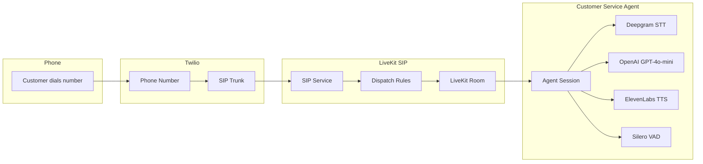
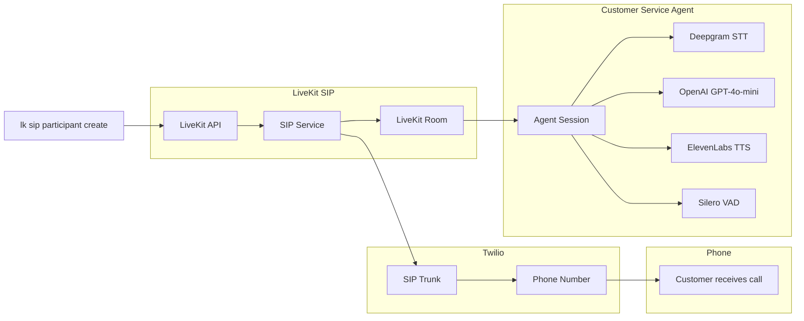

# LiveKit Twilio Customer Service Agent

AI-powered voice assistant that handles phone calls through LiveKit SIP integration with Twilio, representing Dan and Dave's AI Consulting in Tahoe, CA.

## Features

- **Voice AI Assistant**: Powered by OpenAI GPT-4o-mini with ElevenLabs TTS and Deepgram STT
- **Phone Integration**: Handles inbound/outbound calls via Twilio SIP trunks
- **Noise Cancellation**: Enhanced audio processing for telephony applications
- **Multi-language Support**: Voice activity detection with multilingual turn detection

## Prerequisites

- Python 3.11+
- [LiveKit account](https://livekit.io/) with SIP service enabled
- [Twilio account](https://www.twilio.com/) with phone number and SIP trunking
- [LiveKit CLI](https://docs.livekit.io/home/cli/) installed (`lk` command)
- API keys for OpenAI, ElevenLabs, and Deepgram

## Setup

1. **Install dependencies**:
   ```bash
   uv sync
   ```

2. **Configure environment variables**:
   ```bash
   cp .env.example .env
   ```
   Edit `.env` with your API keys and credentials.

3. **Set up telephony configuration**:
   ```bash
   cp livekit-telephony-templates/*.template .
   # Remove .template extension from each file
   for file in *.template; do mv "$file" "${file%.template}"; done
   ```
   Edit each JSON file with your specific credentials.

4. **Initialize LiveKit SIP trunks**:
   ```bash
   uv run scripts/setup_livekit_telephony.py
   ```

## Usage

Start the voice AI agent:
```bash
uv run python agent.py dev
```

The agent will:
- Connect to your LiveKit room
- Handle incoming phone calls via configured SIP trunks
- Respond as a helpful assistant representing Dan and Dave's AI Consulting

## Testing

You can test the agent by making SIP calls using the LiveKit CLI:

1. **Create a test participant** (makes an outbound call):
   ```bash
   lk sip participant create participant.json
   ```

2. **List active SIP participants**:
   ```bash
   lk sip participant list
   ```

3. **Delete a SIP participant** (hang up call):
   ```bash
   lk sip participant delete <participant-id>
   ```

The `participant.json` file configures:
- Source phone number (`sip_number`)
- Destination phone number (`sip_call_to`) 
- LiveKit room to join (`room_name`)
- SIP trunk to use (`sip_trunk_id`)

**Note**: Use the template from `livekit-telephony-templates/participant.json.template` to create your `participant.json` file with your specific phone numbers and trunk ID.

## Architecture

### Inbound Call Flow


### Outbound Call Flow


**Main Components:**
- `agent.py` - Voice AI agent with OpenAI GPT-4o-mini, ElevenLabs TTS, Deepgram STT
- `scripts/setup_livekit_telephony.py` - Automated Twilio/LiveKit setup
- `livekit-telephony-templates/` - Configuration templates for SIP trunks, dispatch rules, and test participants
